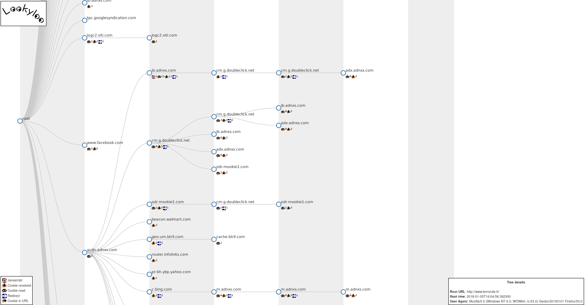

*Lookyloo* is a web interface allowing to scrape a website and then displays a
tree of domains calling each other.

# What is that name?!


```
1. People who just come to look.
2. People who go out of their way to look at people or something often causing crowds and more disruption.
3. People who enjoy staring at watching other peoples misfortune. Oftentimes car onlookers to car accidents.
Same as Looky Lou; often spelled as Looky-loo (hyphen) or lookylou
In L.A. usually the lookyloo's cause more accidents by not paying full attention to what is ahead of them.
```

Source: [Urban Dictionary](https://www.urbandictionary.com/define.php?term=lookyloo)

# Screenshot



# Implementation details

This code is very heavily inspired by [webplugin](https://github.com/etetoolkit/webplugin) and adapted to use flask as backend.

# Installation of har2tree

The core dependency is ETE Toolkit, which you can install following the guide
on the official [website](http://etetoolkit.org/download/)

Note: all the PyQt4 dependencies are optional.

# Installation of scrapysplashwrapper

You need a running splash instance, preferably on [docker](https://splash.readthedocs.io/en/stable/install.html)

```bash
sudo apt install docker.io
sudo docker pull scrapinghub/splash
sudo docker run -p 8050:8050 -p 5023:5023 scrapinghub/splash --disable-ui --disable-lua
# On a server with a decent abount of RAM, you may want to run it this way:
# sudo docker run -p 8050:8050 -p 5023:5023 scrapinghub/splash --disable-ui -s 100 --disable-lua -m 50000
```

# Installation of the whole thing

```bash
pip install -r requirements.txt
pip install -e .
wget https://d3js.org/d3.v4.min.js -O lookyloo/static/d3.v4.min.js
wget https://cdn.rawgit.com/eligrey/FileSaver.js/5733e40e5af936eb3f48554cf6a8a7075d71d18a/FileSaver.js -O lookyloo/static/FileSaver.js
```
# Run the app locally

```bash
export FLASK_APP=lookyloo
flask run
```

## With a reverse proxy (Nginx)

```bash
pip install uwsgi
```

### Config files

You have to configure the two following files:

* `etc/nginx/sites-available/lookyloo`
* `etc/systemd/system/lookyloo.service`

And copy them to the appropriate directories and run the following command:
```bash
sudo ln -s /etc/nginx/sites-available/lookyloo /etc/nginx/sites-enabled
```

If needed, remove the default site
```bash
sudo rm /etc/nginx/sites-enabled/default
```

Make sure everything is working:

```bash
sudo systemctl start lookyloo
sudo systemctl enable lookyloo
sudo nginx -t
# If it is cool:
sudo service nginx restart
```

And you can open ```http://<IP-or-domain>/```

Now, you should configure [TLS (let's encrypt and so on)](https://www.digitalocean.com/community/tutorials/how-to-secure-nginx-with-let-s-encrypt-on-ubuntu-16-04)

